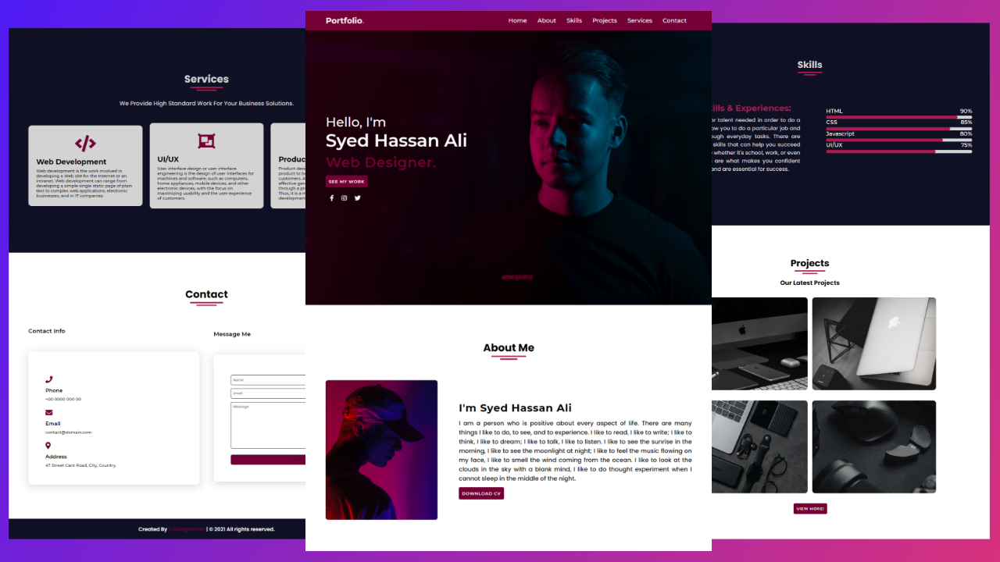

## Project "Syed Hassan Ali" (Portfolio Website)
### Watch The Complete Tutorial : [Click Here!](https://youtu.be/zJhOfRfGDyk)
### Live Preview : [Click Here!](https://trusting-stonebraker-f20612.netlify.app)

I will teach you How to Make a Responsive Website Using HTML & CSS with Flexbox. On this website, I'm using Modern Web Technologies Like Flexbox and Animation, transition & CSS Units Just px and Ram.
This Website is Fully Responsive and the Beginner that Understands How things are Works.
Also, Make this website Responsive to use 3 standard sizes Screen of Media Queries:
 1. Big Screen or Laptop: 1366px
 2. Pad or iPad: 768px
 3. Small Screen: 480px or 530px.

In the upcoming video, I'm Used both Flexbox and Grid System.

<b> Code by Abdul Hadi</b>

